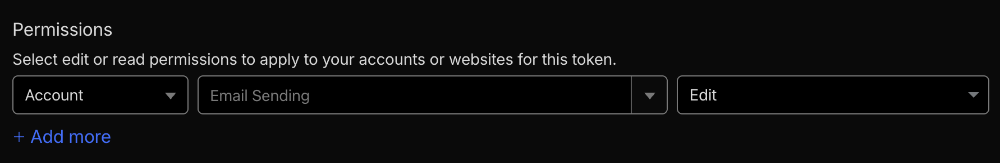
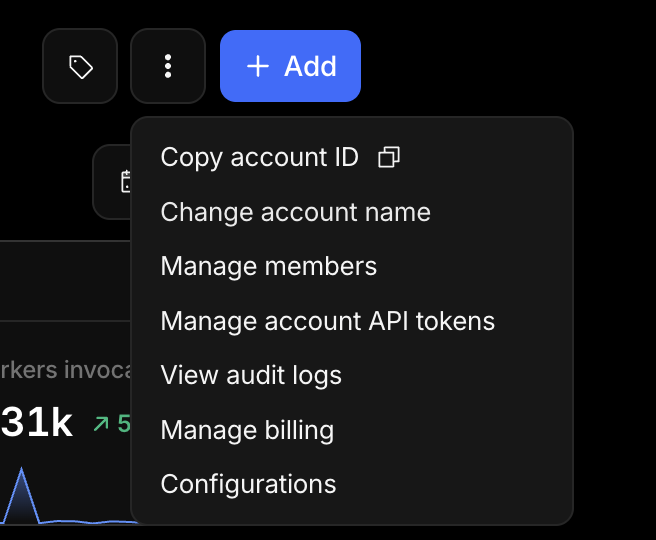

import { TypeTable } from 'fumadocs-ui/components/type-table';

The Cloudflare Email transport is an official Better-Notify package that sends email through the [Cloudflare Email Service](https://developers.cloudflare.com/email-service/) REST API. Use it when you are already on Cloudflare and want transactional email without an external provider.

It uses plain `fetch()` with zero external dependencies, so it works in Node.js, Cloudflare Workers, and any runtime with a global `fetch`.

<Callout type="info">
  Cloudflare Email Service is currently in **beta** and requires a Workers Paid plan.
</Callout>

## Install

```package-install
@betternotify/cloudflare-email @betternotify/core @betternotify/email
```

## Getting your credentials

You need two values: an **API token** and your **account ID**.

### API token

1. Go to [API Tokens](https://dash.cloudflare.com/profile/api-tokens) in your Cloudflare dashboard.
2. Click **Create Token**.
3. Select **Create Custom Token**.
4. Under **Permissions**, set **Account** > **Email Sending** > **Edit**.



5. Click **Continue to summary**, then **Create Token**.
6. Copy the token — you will not see it again.

### Account ID

1. Go to your [Cloudflare dashboard](https://dash.cloudflare.com) home page.
2. Click the **three-dot menu** (⋮) next to your account name.
3. Select **Copy account ID**.



Store both values as environment variables:

```sh
CF_ACCOUNT_ID=your-account-id
CF_API_TOKEN=your-api-token
```

## Usage

```ts
import { createNotify, createClient } from '@betternotify/core';
import { emailChannel } from '@betternotify/email';
import { cloudflareEmailTransport } from '@betternotify/cloudflare-email';

const email = emailChannel({
  defaults: { from: { name: 'My App', email: 'noreply@example.com' } },
});

const rpc = createNotify({ channels: { email } });
const catalog = rpc.catalog({
  /* routes */
});

const mail = createClient({
  catalog,
  channels: { email },
  transportsByChannel: {
    email: cloudflareEmailTransport({
      accountId: process.env.CF_ACCOUNT_ID!,
      apiToken: process.env.CF_API_TOKEN!,
    }),
  },
});
```

## Options

<TypeTable
  type={{
    accountId: {
      description: 'Your Cloudflare account ID. Required.',
      type: 'string',
    },
    apiToken: {
      description: 'Cloudflare API token with email sending permissions. Required.',
      type: 'string',
    },
    baseUrl: {
      description: 'Override the Cloudflare API base URL. Useful for testing.',
      type: 'string',
      default: '"https://api.cloudflare.com"',
    },
    logger: {
      description: 'Override the default logger.',
      type: 'LoggerLike',
    },
  }}
/>

## Error handling

The transport maps Cloudflare error codes to Better-Notify error codes:

| Cloudflare code | Meaning | Better-Notify code |
| --- | --- | --- |
| 10001 | Invalid request schema | `VALIDATION` |
| 10200 | Invalid email content | `VALIDATION` |
| 10201 | Missing content length | `VALIDATION` |
| 10202 | Message too large | `VALIDATION` |
| 10203 | Sending disabled | `CONFIG` |
| 10004 | Rate limited | `PROVIDER` |
| 10002 | Internal server error | `PROVIDER` |

Network failures and unparseable responses are wrapped as `PROVIDER` errors.

## Attachments

The transport base64-encodes attachment content and infers the `disposition` from the `cid` field:

- If `cid` is set, the attachment is sent as `inline` with a `contentId`.
- Otherwise it is sent as `attachment`.
- If `contentType` is not set, it defaults to `application/octet-stream`.

## Limits

These limits are enforced by Cloudflare, not by the transport:

- **50 recipients** per email (to + cc + bcc combined)
- **5 MiB** total message size (25 MiB for verified addresses)
- **998 characters** subject line (RFC 5322)
- **16 KB** custom headers
- Daily sending limits vary by account standing

If you need throttling or provider fallback, add `withRateLimit` middleware or wrap the transport in `multiTransport({ strategy: 'failover' })`.
